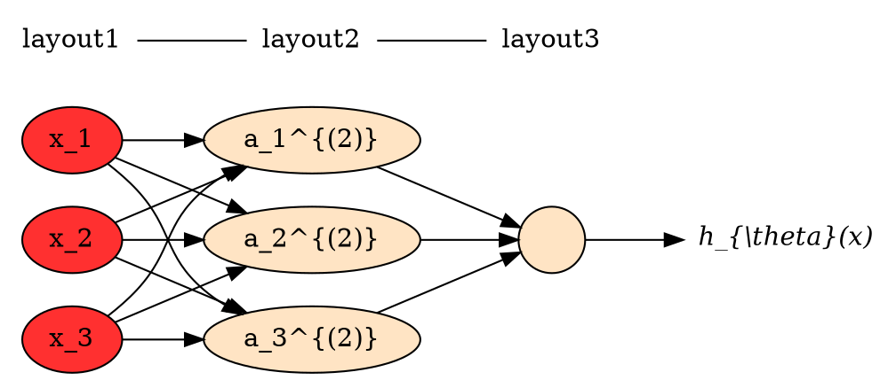

# 前馈神经网络

假使在图像识别中，我们采用的都是50x50像素的小图片，并且我们将所有的像素视为特征，则会有 $2500^2 /2$个特征，如果我们要进一步将两两特征组合构成一个多项式模型，则会有约个（接近3百万个）特征。普通的逻辑回归模型，不能有效地处理这么多的特征这时候我们需要神经网络。虽然神经网络也是计算量偏大的（神经网络兴起在80年代，在90年代的后期神经网络应用减少了。但是最近，神经网络又东山再起了。其中一个原因是：神经网络是计算量有些偏大的算法。然而大概由于近些年计算机的运行速度变快，才足以真正运行起大规模的神经网络。）相比下普通的逻辑回归模型的多项式计算量更大。

下图是一个神经网络,其中$x_1,x_2,x_3,$是输入单元（input unit），我们将原始数据给它们。$a_1,a_2,a_3,$是中间单元它们负责将数据进行处理，然后呈递到下一层。 最后是输出单元，它负责计算$h_{\theta}(x)$。
在描述模型时约定标记：

- $z^{(l)} \in \mathbb{R}^{S_l}$表示$l$层神经元的净输入
- $a^{(l)} \in \mathbb{R}^{S_l}$表示$l$层神经元的输出（活性值）
- **$a_j^{(i)}$代表第$i$层的第$j$个激活单元**。
- $L$代表神经网络层数，
- $S_l$表示第$l$层的neuron个数(不包括bias unit)
- $W^{(l)} \in \mathbb{R}^{S_l \times S_{(l-1)}} $：表示$l − 1$ 层到第$l$ 层的权重矩阵；
- $f_{l}$代表$l$层神经元的激活函数
  


其实神经网络就像是logistic regression，只不过我们把logistic regression中的输入向量$[x_1,x_2,...x_3]^T$成了中间层的$[a_1^{(2)},a_2^{(2)},...a_3^{(2)}]^T$,是标量$x$的进化体，并且它们是由$x,\theta$决定的,由于梯队下降所以$a$是变化的,并且变得越来越厉害。 这就是神经网络相比于逻辑回归和线性回归的优势。

前馈神经网络通过下面的公式进行信息传播
$$z^{(l)}=W^{(l)}.a^{(l-1)}$$
$$a^{(l)}=f_{l} (z^{(l)})$$

## 参数学习

梯度下降法需要计算损失函数对参数的偏导数，由于参数众多，显然如果通过链式法则逐一对每个参数进行求偏导效率比较低。在神经网络的训练中经常使用反向传播算法来计算高效地梯度。 下面将解释反向传播算法。

在前面的数学基础中列出了矩阵偏导公式：若$X \in \mathbb{R}^{p \times q}$为矩阵， $y=g(X) \in \mathbb{R}^s, z=f(y) \in \mathbb{R}$,则$\frac{\partial z}{\partial X_{ij}}=\left( \frac{\partial z}{\partial y} \right)^T \frac{\partial y}{ \partial X_{ij}}$。这个链式公式将在下面需要使用到。

假设损失函数为$J(W,x,y)$。 那么：

$$ \frac{\partial J(W,x,y)}{\partial W_{ij}^{(l)}} = \left( \frac{\partial z^{(l)}}{\partial W_{ij}^{(l)}} \right)^T \frac{\partial J(W,x,y)}{\partial z^{(l)}} $$

由于$z^{(l)}=W^{(l)}.a^{(l-1)}$，因此对第一项:
$$\frac{\partial z^{(l)}}{\partial W_{ij}^{(l)}} = \frac{\partial( W^{(l)}.a^{(l-1)}) }{\partial W_{ij}^{(l)}}$$

同时根据前面数学基础中介绍的：对于一个 $d$维向量$x \in \mathbb{R}^d$, 函数$f(x)=f(x_1,...,x_d) \in \mathbb{R}$，则  $f(x)$ 关于 $x$的偏导数为$\frac{\partial f(x)}{\partial x} = \begin{bmatrix} \frac{\partial f(x)}{\partial x_1} \\ .. \\ .. \\ .. \\ \frac{\partial f(x)}{\partial x_d} \end{bmatrix} \in \mathbb{R}^d $，我们可以得到：

$$\frac{\partial z^{(l)}}{\partial W_{ij}^{(l)}} = \frac{\partial( W^{(l)}.a^{(l-1)}) }{\partial W_{ij}^{(l)}}=\begin{bmatrix} \frac{\partial ( W^{(l)}_{1:}.a^{(l-1)}) }{\partial \partial W_{ij}^{(l)}} \\ .. \\ \frac{\partial ( W^{(l)}_{ i:}.a^{(l-1)})}{\partial \partial W_{ij}^{(l)}} \\ .. \\ \frac{\partial ( W^{(l)}_{ s^{(l)}:}.a^{(l-1)})}{\partial \partial W_{ij}^{(l)}} \end{bmatrix} =\begin{bmatrix} 0 \\ .. \\ a_{j}^{(l-1)} \\ .. \\ 0 \end{bmatrix}  \in \mathbb{R}^d $$

对第二项定义为$\delta^{(l)}$:
$$\delta^{(l)}=\frac{\partial J(W,x,y)}{\partial z^{(l)}} = \frac{\partial (W^{(l+1)}.a^{(l)})}{\partial z^{(l)}} $$

$$ = \frac{\partial a^{(l)}}{ \partial z^{(l)}} . \frac{\partial z^{(l+1)}}{ \partial a^{(l)}}  .  \frac{\partial  J(W,x,y) }{ \partial z^{(l+1)}} $$

$$= diag({f}'_{l}(z^{(l)})) \odot ( (W^{(l+1)})^T \delta^{(l+1)} )$$
- cost function：

最终得到的反向传播算法（BP）的训练过程为：
```golang
//输入: 训练集合m个样本，
//1. 随机初始化 W

```

- Hypothesis function:

  对于

## example

### 前向传播

样例代码见[ExampleFeedForwardPrediction_ex3weights()](neuron\neuron_example_test.go),这个demo演示了通过前向神经网络来识别图片。
另外通过普通logistics regression来识别图片的演示在前面 [ExampleMultiClassClassification_ex3data1()](logicregression\logic_example_test.go)样例代码也演示过.

对应前向传播如字面意思，就是输入->layer-1->layer-2->layer-3。。。逐层的往后，最终得到预测函数$h_{\Theta}(x)$需要的$\Theta$。这里用大写的$\Theta$，因为这是一个矩阵。
