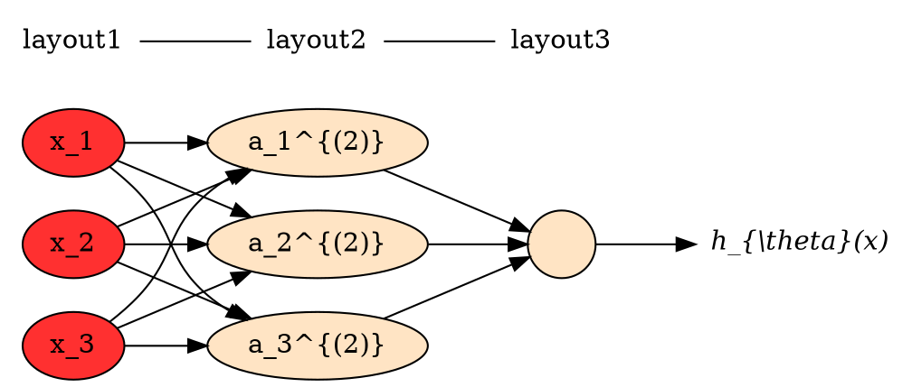

# preface

该markdown文件在vscode [MPE](https://shd101wyy.github.io/markdown-preview-enhanced/#/zh-cn/)插件下显示没有问题，其他工具没有尝试过。由于有些图是采用[gnuplot](http://gnuplot.sourceforge.net)与[graphviz](http://www.graphviz.org/)显示，因此如果需要显示完整也需要安装gnuplot,graphviz.

该repository的主要是自己学习中的一些笔记，如果能对其他人有帮助，那是额外的奖励。

# introduction

目前存在几种不同类型的学习算法。主要的两种类型被我们称之为监督学习和无监督学习。简单来说，监督学习这个想法是指，我们将教计算机如何去完成任务，而在无监督学习中，我们打算让它自己进行学习。此外还有诸如，强化学习和推荐系统等各种术语。这些都是机器学习算法的一员，以后我们都将介绍到，但学习算法最常用两个类型就是监督学习、无监督学习。

NG(吴恩达)建议：如果使用Octave作为编程环境，如果使用Octave作为学习工具，以及作为原型工具，它会让你对学习算法的学习和建原型快上许多。

在下面讨论中，描述问题的约定缩写包括：

- $m$ 代表训练集中实例的数量
- $x$ 代表特征/输入变量
- $y$ 代表目标变量/输出变量
- $(x,y)$ 代表训练集中的实例
- $(x^{(i)},y^{(i)})$ 代表第 个观察实例
- $h$ 代表学习算法的解决方案或函数也称为假设（**hypothesis**）
- $J$ 代表代价函数

模型所预测的值与训练集中实际值之间的差距就是建模误差（modeling error）,通常定义代价函数采用平方误差代价函数：
$$J(\theta)=\frac{1}{2m} \sum_{i=1}^{m}(h_{\theta}(x^{(i)})-y^{(i)})^2 $$

- 注：这是linear regression的代价函数，不适合类似logistics regression，因为logistic regression的$h_\theta$是一个非线性的，导致对应$J_\theta$会是非凸函数。

对于凸函数，特征就是求导是单调的，从$z^2$函数的下面图形明显可以看出它是一个凸函数。

```gnuplot {cmd=true output="html" }
set terminal svg
set size ratio 0.5
set xrange [-1:1]
f(x,x0) = 2*(x0) * ((x)-(x0)) + (x0**2)
set arrow from  0.7,f(0.7,0.6) to  0.5, f(0.5,0.6)
set arrow from   -0.7,f(-0.7,-0.6)  to -0.5, f(-0.5,-0.6)
set arrow from   -0.4,f(-0.4,-0.3)  to -0.2, f(-0.2,-0.3)
plot x**2
```

目标就是找到适合的$\theta$,使得 $minimize(J(\theta)) $

梯度下降背后的思想是：开始时我们随机选择一个参数的组合，计算代价函数，然后我们寻找下一个能让代价函数值下降最多的参数组合。我们持续这么做直到到到一个局部最小值（local minimum），因为我们并没有尝试完所有的参数组合，所以不能确定我们得到的局部最小值是否便是全局最小值（global minimum），选择不同的初始参数组合，可能会找到不同的局部最小值。

每个参数$\theta_i$的梯度负方向在数学上就是对各个$\theta_i$求偏导。


梯度下降算法的公式为：
**repeat until convergence  {**
$$\theta_j:=\theta_j - \alpha \frac{\partial}{\partial \theta_j}J(\theta)$$
**}**
其中$\alpha$是学习率（learning rate），它决定了我们沿着能让代价函数下降程度最大的方向向下迈出的步子有多大，在批量梯度下降中，我们每一次都同时让所有的参数减去学习速率乘以代价函数的导数。

在公式中为什么是“-”负号，而不是“+”号，这个从上面凸函数的图形可以直观的理解。在0右侧，求导会是一个正值，减去它就是向低点靠近（x向左）；而在0左侧，求导会是负的，负负为正效果也是向低点靠近（x向右）

让我们来看看如果$\alpha$太小或太大会出现什么情况：

- 如果太小了，即我的学习速率太小，结果就是只能这样像小宝宝一样一点点地挪动，去努力接近最低点，这样就需要很多步才能到达最低点，所以如果太小的话，可能会很慢，因为它会一点点挪动，它会需要很多步才能到达全局最低点。
- 如果太大，那么梯度下降法可能会越过最低点，甚至可能无法收敛，下一次迭代又移动了一大步，越过一次，又越过一次，一次次越过最低点，直到你发现实际上离最低点越来越远，所以，如果太大，它会导致无法收敛，甚至发散。

如果我们预先把放在一个局部的最低点，你认为下一步梯度下降法会怎样工作？

假设你将$\theta$初始化在局部最低点，在这儿，它已经在一个局部的最优处或局部最低点。结果是局部最优点的导数将等于零，因为它是那条切线的斜率。这意味着你已经在局部最优点，它使得$\theta$不再改变，也就是新$\theta$的等于原来的$\theta$，因此，如果你的参数已经处于局部最低点，那么梯度下降法更新其实什么都没做，它不会改变参数的值。这也解释了为什么即使学习速率保持不变时，梯度下降也可以收敛到局部最低点。

这就是梯度下降算法，你可以用它来最小化任何代价函数$J$，不只是线性回归中的代价函数$J$。

## 批量梯度BGD（batch gradient descent）

它的具体思路是在更新每一参数(也称为$\theta$)时都使用所有的样本来进行更新.采用**最小化风险函数**，所以按照每个参数$\theta_i$的梯度负方向来更新每个$\theta_i$

对于梯度算法中的$ \frac{\partial}{\partial \theta_j}J(\theta)$，在批量梯度下降中是
$$\alpha \frac{\partial}{\partial \theta_j}J(\theta) := \theta_j - \frac{1}{2m} \sum_{i=1}^{m} (h_{\theta}(x^{(i)})-y^{(i)})  x_{j}^{(i)} $$

推导过程就是取偏导的过程，在后面的线性回归中描述了推导过程。

## 随机梯度下降法SGD(Stochastic Gradient Descent)

由于批量梯度下降法在更新每一个参数时，都需要所有的训练样本，所以训练过程会随着样本数量的加大而变得异常的缓慢。随机梯度下降法（简称SGD）正是为了解决批量梯度下降法这一弊端而提出的。

它是利用每个样本的损失函数对θ求偏导得到对应的梯度，来更新θ，而不是对所有样本损失最小化。

随机梯度下降是通过每个样本来迭代更新一次，如果样本量很大的情况（例如几十万），那么可能只用其中几万条或者几千条的样本，就已经将theta迭代到最优解了，对比上面的批量梯度下降，迭代一次需要用到十几万训练样本，一次迭代不可能最优，如果迭代10次的话就需要遍历训练样本10次。但是，SGD伴随的一个问题是噪音较BGD要多，使得SGD并不是每次迭代都向着整体最优化方向。

- 优点：训练速度快；

- 缺点：准确度下降，并不是全局最优；不易于并行实现。

对于梯度算法中的$ \frac{\partial}{\partial \theta_j}J(\theta)$，在批量梯度下降中是
$$\alpha \frac{\partial}{\partial \theta_j}J(\theta) := \theta_j -  (h_{\theta}(x^{(i)})-y^{(i)})  x_{j}^{(i)} $$

```python
for i in range(nb_epochs):
  params_grad = evaluate_gradient(loss_function, data, params)
  params = params - learning_rate * params_grad
```  

## 小批量梯度下降法MBGD（Mini-batch Gradient Descent）

它是BGD/SGD方式的折衷，MBGD在每次更新参数时使用b个样本（b一般为10），使得b个样本最小化损失。

对于梯度算法中的$ \frac{\partial}{\partial \theta_j}J(\theta)$，在批量梯度下降中是
$$\alpha \frac{\partial}{\partial \theta_j}J(\theta) := \theta_j - \frac{1}{2m} \sum_{i=k}^{k+b} (h_{\theta}(x^{(i)})-y^{(i)})  x_{j}^{(i)} $$

# csvdata package

in this package,provide same help function to read csv data and output to gonum dense

# linear regression package

- Hypothesis function:
   $$h_\theta(x) = \theta^T x$$
- cost function：
  $$J(\theta)=\frac{1}{2m} \sum_{i=1}^{m}(h_{\theta}(x^{(i)})-y^{(i)})^2 $$
  $$\theta_j:=\theta_j - \alpha \frac{\partial}{\partial \theta_j}J(\theta)$$

$\frac{\partial}{\partial \theta_j}J(\theta)$的推导过程如下：
$$\frac{\partial}{\partial \theta_j}J(\theta)=  \frac{\partial}{\partial \theta_j} \frac{1}{2m} \sum_{i=1}^{m}(h_{\theta}(x^{(i)})-y^{(i)})^2  $$
通过分步求导,将$(h_{\theta}(x^{(i)})-y^{(i)})$以$z$表示继续：
$$=\frac{\partial }{\partial z} \frac{1}{2m} \sum_{i=1}^{m}(z)^{2} \frac{\partial z}{ \partial \theta_j } = \frac{1}{2m} \sum_{i=1}^{m} z \frac{\partial z}{ \partial \theta_j } $$

将$z$替换回$(h_{\theta}(x^{(i)})-y^{(i)})$继续:
$$= \frac{1}{2m} \sum_{i=1}^{m} (h_{\theta}(x^{(i)})-y^{(i)}) \frac{\partial (h_{\theta}(x^{(i)})-y^{(i)})}{ \partial \theta_j } = \frac{1}{2m} \sum_{i=1}^{m} (h_{\theta}(x^{(i)})-y^{(i)})  x_{j}^{(i)}  $$

因此线性回归的梯队下降算法最终为：
批量梯度下降（batch gradient descent）算法的公式为：
repeat until convergence {
$$\theta_j:=\theta_j - \alpha \frac{\partial}{\partial \theta_j}J(\theta) := \theta_j - \frac{1}{2m} \sum_{i=1}^{m} (h_{\theta}(x^{(i)})-y^{(i)})  x_{j}^{(i)} $$
}
注：$x_{j}^{(i)} $中的$i$表示第$i_{th}$个样本，$j$表示该样本中的第$j_{th}$个。

上面的算法，有时也称为批量梯度下降。实际上，在机器学习中，通常不太会给算法起名字，但这个名字”批量梯度下降”，指的是在梯度下降的每一步中，我们都用到了所有的训练样本，在梯度下降中，在计算微分求导项时，我们需要进行求和运算，所以，在每一个单独的梯度下降中，我们最终都要计算这样一个东西，这个项需要对所有$m$个训练样本求和。因此，批量梯度下降法这个名字说明了我们需要考虑所有这一"批"训练样本，而事实上，有时也有其他类型的梯度下降法，不是这种"批量"型的，不考虑整个的训练集，而是每次只关注训练集中的一些小的子集。

## '正则化linear regression'

   高次项往往是引起过拟合的因素，因此惩罚高次项(即减小高次项的系数)往往能较好解决过拟合问题。假如我们有非常多的特征，我们并不知道其中哪些特征我们要惩罚，我们将对所有的特征进行惩罚，并且让代价函数最优化的软件来选择这些惩罚的程度。这样的结果是得到了一个较为简单的能防止过拟合问题的假设： 引入正则化参数$ \lambda$ ,新的linear regression的cost function就是下面的这样的样子：
  $$J(\theta)=\frac{1}{2m} [\sum_{i=1}^{m}(h_{\theta}(x^{(i)})-y^{(i)})^2 +\lambda \sum_{j=1}^{m} \theta_{j}^{2}]$$

显然对应的梯度下降应该是：
repeat until convergence {
   ${\theta_0}:={\theta_0}-a\frac{1}{m}\sum\limits_{i=1}^{m}{(({h_\theta}({{x}^{(i)}})-{{y}^{(i)}})x_{0}^{(i)}})$

   ${\theta_j}:={\theta_j}-a[\frac{1}{m}\sum\limits_{i=1}^{m}{(({h_\theta}({{x}^{(i)}})-{{y}^{(i)}})x_{j}^{\left( i \right)}}+\frac{\lambda }{m}{\theta_j}]$
​
   $for$ $j=1,2,...n$
}

注：在go代码示例中，没有使用$\lambda$正则惩罚系数，而是仅仅对每列数据作了特征归一化,这个后续补上。

# logistic regression package

逻辑回归是用来处理分类的,对于分类问题不适合用linear regression,具体原因有数学家门已经证明过了。因此自己也不纠结为什么了。

数学家引入一个新的模型，逻辑回归，该模型的输出变量范围始终在0和1之间。 逻辑回归模型的假设是： $h_\theta(x) = g(\theta^T X)$其中： $X$代表特征向量,$g$ 代表逻辑函数（logistic function)是一个常用的逻辑函数为S形函数（Sigmoid function），公式为：$g(z)=\frac{1}{1+e^{-z}}$ 。

$h_\theta(x)$的作用是，对于给定的输入变量，根据选择的参数计算输出变量=1的可能性（estimated probablity）即$h_\theta(x)=P(y=1|x;\theta)$ .例如，如果对于给定的$x$，通过已经确定的参数计算得出$h_\theta(x)=0.7$，则表示有70%的几率为正向类，相应地为负向类的几率为1-0.7=0.3。

- Hypothesis function:
   $$h_\theta(x) = g(\theta^T x)$$
   $$g(z)=\frac{1}{1+e^{-z}}$$

- cost function：
  $$J(\theta)=\frac{1}{m} \sum_{i=1}^{m}cost(h_{\theta}(x),y)$$

    $$cost(h_{\theta}(x),y)=\left\{\begin{matrix}
    -log(h_{\theta}(x)) &\text{if } y=1  \\
    -log(1-h_{\theta}(x)) & \text{if } y=0
    \end{matrix}\right.$$

    下图以$h_{\theta}(x)$结果作为变量的是对应的函数图形，从图中可以看出特点是：当实际的$y=0$且$h_{\theta}(x)$也为0时代价为0，当的$y=0$且$h_{\theta}(x)$不为0时，随着$h_{\theta}(x)$的变大而变大。
    ```gnuplot {cmd=true output="html" }
    set terminal svg
    set size ratio 0.5
    set xrange [0:1]
    plot -log(x), -log(1-x)
    ```
    为了计算方便，可以对$cost(h_{\theta}(x),y)$换下面的写法，之所以可以改写为下面是因为$y$取值只会是1/0.

    $$cost(h_{\theta}(x),y)= -y \times log(h_{\theta}(x)) - (1-y) \times log(1- h_{\theta}(x))$$

    $$J(\theta)=\frac{1}{m} \sum_{i=1}^{m} \left[  -y^{(i)} \times log(h_{\theta}(x^{(i)})) - (1-y^{(i)}) \times log(1- h_{\theta}(x^{(i)}))  \right] $$

    $\frac{\partial}{\partial \theta_j}J(\theta)$的推导过程如下：
    $$\frac{\partial}{\partial \theta_j}J(\theta)=  \frac{\partial}{\partial \theta_j} \frac{1}{m} \sum_{i=1}^{m}  \left[  -y^{(i)} \times log(h_{\theta}(x^{(i)})) - (1-y^{(i)}) \times log(1- h_{\theta}(x^{(i)}))  \right] $$
    将 $h_\theta(x^{(i)}) = \frac{1}{1+e^{-\theta^T x^{(i)}}}$代入得到：

    $$\frac{\partial}{\partial \theta_j}J(\theta)=  \frac{\partial}{\partial \theta_j} \frac{1}{m} \sum_{i=1}^{m}  \left[  -y^{(i)} \times log(\frac{1}{1+e^{-\theta^T x^{(i)}}}) - (1-y^{(i)}) \times log(1- \frac{1}{1+e^{-\theta^T x^{(i)}}})  \right] $$

    $$\frac{\partial}{\partial \theta_j}J(\theta)=  \frac{\partial}{\partial \theta_j} \frac{1}{m} \sum_{i=1}^{m}  \left[  y^{(i)} \times log(  1+e^{-\theta^T x^{(i)}}) + (1-y^{(i)}) \times log( 1+e^{\theta^T x^{(i)}})  \right] $$

    $$=\frac{1}{m} \sum_{i=1}^{m} \left[  y^{(i)} \times  \frac{-x_j^{(i)}e^{-\theta^{T}x^{(i)}}}{1+e^{-\theta^{T}x^{(i)}} } +  (1-y^{(i)})  \times \frac{ x_j^{(i)} e^{\theta^{T}x^{(i)}} }{1+e^{\theta^{T}x^{(i)}}  } \right]$$
    ....
    $$\frac{\partial}{\partial \theta_j}J(\theta)=  \frac{1}{m} \sum_{i=1}^{m}  \left[  h_{\theta}(x^{(i)}) - y^{(i)}  \right] x_{j}^{(i)} $$
    注：虽然得到的梯度下降算法表面上看上去与线性回归的梯度下降算法一样，但是这里的$h_\theta (x)$与线性回归中$h_\theta (x)$不同，所以实际上是不一样的。

## 正则化logistics regression

如线性回归中对正则化的解释，对logistic regressionw我们也给costfunction增加一个正则化的表达式，得到代价函数：
    $$J(\theta)=\frac{1}{m} \sum_{i=1}^{m} \left[  -y^{(i)} \times log(h_{\theta}(x^{(i)})) - (1-y^{(i)}) \times log(1- h_{\theta}(x^{(i)}))  \right] + \frac{\lambda}{2m}  \sum_{j=1}^{m} \theta_{j}^{2} $$

要最小化该代价函数，通过求导，得出梯度下降算法为：
repeat until convergence {
   ${\theta_0}:={\theta_0}-a\frac{1}{m}\sum\limits_{i=1}^{m}{(({h_\theta}({{x}^{(i)}})-{{y}^{(i)}})x_{0}^{(i)}})$

   ${\theta_j}:={\theta_j}-a[\frac{1}{m}\sum\limits_{i=1}^{m}{({h_\theta}({{x}^{(i)}})-{{y}^{(i)}})x_{j}^{\left( i \right)}}+\frac{\lambda }{m}{\theta_j}]$
   $for$ $j=1,2,...n$
}

注：在go代码示例中，没有使用$\lambda$正则惩罚系数，而是仅仅对每列数据作了特征归一化,这个后续补上。

## example

### 多类别分类

样例代码见  [ExampleMultiClassClassification_ex3data1()](logicregression\logic_example_test.go). 训练数据*ex3data1*是数字1/2/3...的灰度强度数据。
多分类的处理其实就是转换为二分类的组合，以训练label"1"为例，当训练label“1”时，将其他label的训练Y值设置为0概率值，然后训练出label"1"对应的参数（theta），以此类推。

# Neural Networks

假使在图像识别中，我们采用的都是50x50像素的小图片，并且我们将所有的像素视为特征，则会有 $2500^2 /2$个特征，如果我们要进一步将两两特征组合构成一个多项式模型，则会有约个（接近3百万个）特征。普通的逻辑回归模型，不能有效地处理这么多的特征这时候我们需要神经网络。虽然神经网络也是计算量偏大的（神经网络兴起在80年代，在90年代的后期神经网络应用减少了。但是最近，神经网络又东山再起了。其中一个原因是：神经网络是计算量有些偏大的算法。然而大概由于近些年计算机的运行速度变快，才足以真正运行起大规模的神经网络。）相比下普通的逻辑回归模型的多项式计算量更大。

下图是一个神经网络,其中$x_1,x_2,x_3,$是输入单元（input unit），我们将原始数据给它们。$a_1,a_2,a_3,$是中间单元它们负责将数据进行处理，然后呈递到下一层。 最后是输出单元，它负责计算$h_{\theta}(x)$。
在描述模型时约定标记：

- **$a_j^{(i)}$代表第$i$层的第$j$个激活单元**。
- **$\Theta^{(i)}$代表第$i$层映射到第$i+1$层时权重的矩阵**
- $L$代表神经网络层数，$S_l$表示第$l$层的neuron个数(不包括bias unit)



其实神经网络就像是logistic regression，只不过我们把logistic regression中的输入向量$[x_1,x_2,...x_3]$成了中间层的$[a_1^{(2)},a_2^{(2)},...a_3^{(2)}]$,是$x$的进化体，并且它们是由$x,\theta$决定的,由于梯队下降所以$a$是变化的,并且变得越来越厉害。 这就是神经网络相比于逻辑回归和线性回归的优势。

- cost function：
  
- Hypothesis function:

  对于

## example

### 前向传播

样例代码见[ExampleFeedForwardPrediction_ex3weights()](neuron\neuron_example_test.go),这个demo演示了通过前向神经网络来识别图片。
另外通过普通logistics regression来识别图片的演示在前面 [ExampleMultiClassClassification_ex3data1()](logicregression\logic_example_test.go)样例代码也演示过.

对应前向传播如字面意思，就是输入->layer-1->layer-2->layer-3。。。逐层的往后，最终得到预测函数$h_{\Theta}(x)$需要的$\Theta$。这里用大写的$\Theta$，因为这是一个矩阵。
